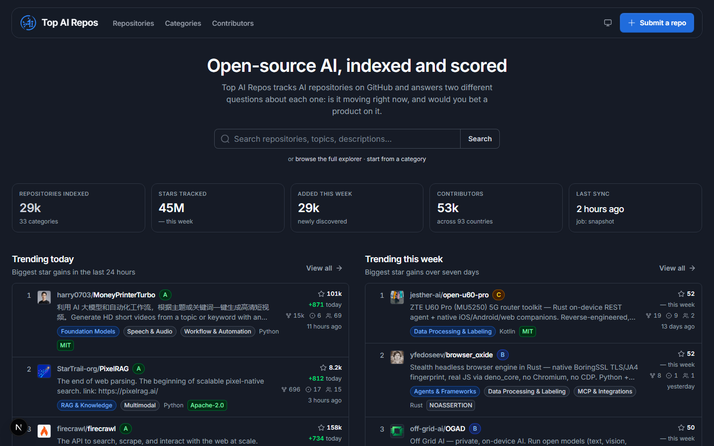
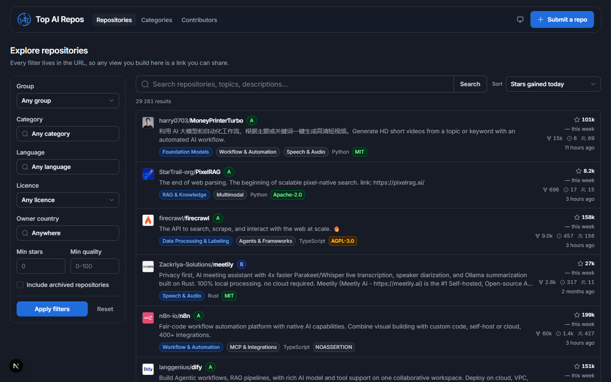
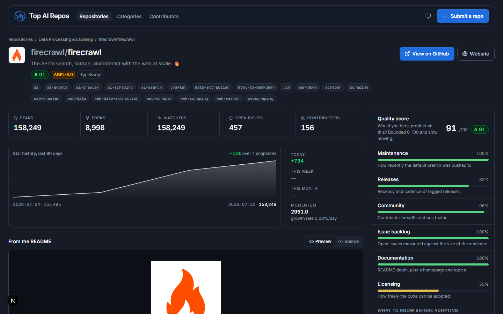
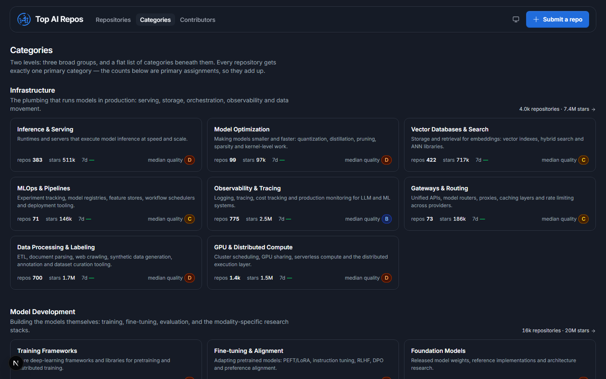

# Top AI Repos

A discovery and tracking site for open-source AI repositories on GitHub.
Canonical domain: **topairepos.com** (`aireporank.com` and `airepolist.com`
redirect to it).

Most "AI list" sites rank by total stars, which mostly tells you what was
popular three years ago. This one tracks **two independent signals**:

- **Trend score** — is this moving *right now*? Computed from daily/weekly star
  deltas, contributor growth and release recency, penalised for inactivity.
  Unbounded and comparative.
- **Quality score** — would you bet a product on it? A bounded 0–100 grade
  across maintenance, release cadence, contributor breadth and bus factor,
  issue-backlog health, documentation, and **license safety**.

A repo can be high-trend and low-quality (a demo that hit the front page) or
low-trend and high-quality (a boring, essential library). Star counts find
neither.

Currently indexing ~30,000 repositories across 33 categories, with ~53,000
contributors. Discovery runs on 317 curated topic slugs plus 61 free-text
phrases — because a third of the most popular AI repos carry no GitHub topics at
all, and topic search can never see them.

---

## Screenshots

**Homepage** — what's moving right now, and what's actually maintained.



**Explorer** — every filter lives in the URL, so any view is a link you can
share. Dropdowns past ten options grow a search box on their own.



**Repository detail** — the quality score broken into the dimensions behind it,
star history, contributors, and licence read in plain English.



**Categories** — three groups, one primary category per repository, so the
counts add up.



Every screenshot is real data from a live run, in dark mode. The UI ships light
and dark; the toggle follows your system by default.

---

## The one command you need

```bash
npm run daily
```

Run that once a day (cron, Task Scheduler, GitHub Actions — anything) and the
site stays current. It runs all eight stages in order:

| Stage | Does | Cost |
| --- | --- | --- |
| `discover` | finds new AI repos via GitHub search | search API (30/min) |
| `sync` | refreshes stars, README, releases, owner location | GraphQL + REST |
| **`snapshot`** | **records today's metrics** | database only |
| `countries` | normalises `owner_location` → `owner_country` | free |
| `contributors` | top contributors per repo → people + link rows | REST |
| `profiles` | enriches top people (supplies their country) | REST |
| `classify` | assigns categories | free (LLM optional) |
| `score` | recomputes trend + quality | free |

Default budgets are sized to fit GitHub's 5,000 requests/hour. Every stage has a
`--skip-<stage>` flag and a tunable limit:

```bash
npm run daily -- --days=2              # only discover recently-created repos
npm run daily -- --sync-limit=3000     # push harder on metadata refresh
npm run daily -- --skip-discover       # refresh what we have, find nothing new
```

**Why `snapshot` runs third rather than last:** it is the only stage whose data
cannot be recovered later — GitHub has no historical-stars API, so a missed day
is gone forever. The stages after it make thousands of API calls and can sit in a
long rate-limit pause; a snapshot scheduled after them would be lost if the
process died. The cost is that today's row carries yesterday's contributor
counts, which does not distort growth: the weekly delta compares two snapshots
lagged identically. `score` stays last because it consumes the snapshot deltas.

Every run is recorded in the `sync_runs` table (status, duration, stats, errors),
so a failed overnight run is visible in the database rather than lost in a
terminal — and the process exits non-zero so a scheduler notices.

## How it works

```
GitHub Search API ──┐
GitHub GraphQL  ────┼──▶  ingestion workers  ──▶  Postgres  ──▶  Next.js UI
user submissions ───┘        (tsx scripts)         (Drizzle)      (Untitled UI)
                                   │
                                   └──▶ OpenAI (classification fallback)
```

1. **Discover** — two complementary sweeps of GitHub search, both sharded by star
   range *and* creation window to get past the API's 1,000-result-per-query cap
   (date bisection is floored at one day, or the recursion never terminates):
   - **~317 curated topic slugs** — high precision, because a topic is the
     author's own declaration of what a repo is.
   - **~61 free-text phrases** matched against name and description — because
     topic search has a hard ceiling. Measured against a sample of genuinely
     popular AI projects, **~67% were unreachable by topic**: `anthropics/claude-code`
     (139k★), `openai/codex` (102k★) and `mattpocock/skills` (196k★) carry *no
     topics at all*, and others tag things nobody would seed ("superpowers",
     "sdlc"). No number of extra slugs fixes that. Phrases are restricted to
     name+description, never README, which is what keeps precision high.
2. **Sync** — bulk-refresh metadata via GraphQL (many repos per request), with
   REST + `If-None-Match` ETags for cheap re-checks. A `304 Not Modified` costs
   no rate-limit quota, so most refreshes are free.
3. **Snapshot** — record stars/forks/issues/contributors, **writing a row only
   when something changed** (see [Database size](#database-size)). GitHub only
   ever tells you *current* values; this table is what makes "+428 today"
   possible, and it is the part you cannot backfill later.
4. **Classify** — rule-based first, using author-declared GitHub topics as the
   strongest signal, then name/description/README keywords with word-boundary
   matching (so "rag" does not match "storage"). Only genuinely ambiguous repos
   escalate to an LLM call, and the result is cached so unchanged repos are never
   re-classified.
5. **Score** — recompute trend and quality for the whole table after each sync.

## Setup

Requires **Node 22.6+** and Postgres 17. A hosted database (Supabase or Neon free
tier) is plenty to start; if you outgrow it — or would rather not pay egress on
every row the app reads — [docs/MIGRATION.md](docs/MIGRATION.md) is a runbook for
moving the data onto a Postgres you run yourself, without losing the snapshot
history that cannot be rebuilt.

```bash
npm install
cp .env.example .env      # then fill in DATABASE_URL and GITHUB_TOKEN
npm run db:migrate        # create the schema
npm run seed              # load the category taxonomy
npm run daily             # first ingestion (takes a while)
npm run dev               # the site at http://localhost:3000
```

### Filling in `.env`

| Variable | Required | Where to get it |
| --- | --- | --- |
| `DATABASE_URL` | yes | [Supabase](https://supabase.com/dashboard) or [Neon](https://console.neon.tech) connection string. See the connection notes below. |
| `GITHUB_TOKEN` | yes | [github.com/settings/tokens](https://github.com/settings/tokens). No scopes needed — we only read public data. Raises the limit from 60 to 5,000 requests/hour. |
| `OPENAI_API_KEY` | optional | Only used for classifying repos the rules can't place. Leave blank to run rules-only. |
| `NEXT_PUBLIC_SITE_URL` | for deploy | The canonical origin. Drives canonical tags, the sitemap, OG images and the domain redirect. **Must** be the real domain before building, or Google indexes localhost. |
| `NEXT_PUBLIC_GITHUB_REPO` | optional | This project's own repo as `owner/name`, for the star count in the header. Defaults to `kittisora/top-ai-repos`; point a fork at its own repo. |

**Supabase connection string:** use the **Session pooler** (port 5432). The
direct connection is IPv6-only on the free tier and fails from most networks; the
transaction pooler (6543) lacks the prepared statements and advisory locks
migrations need. Append `?sslmode=no-verify` — the pooler presents a certificate
signed by Supabase's own CA, so `require`/`verify-full` fail with
`SELF_SIGNED_CERT_IN_CHAIN` (the connection is still TLS-encrypted; only the CA
check is skipped). Percent-encode special characters in the password.

**Row-level security:** the migrations enable RLS on every table. Supabase
exposes public-schema tables through its REST API, and tables created by
migrations do not get RLS automatically — without it, anyone with the project URL
and anon key could read *or delete* the index. RLS with no policies is
default-deny; the app connects as `postgres`, which bypasses it.

## Database size

The free tier is **500 MB**, and snapshots are what grow. Two decisions keep this
project comfortably inside it (~162 MB, growing ~8 MB/month):

**Snapshots are change-only.** A row per repo per day is 29,000 rows ≈ 5.7 MB/day
(~170 MB/month), and measured over a real two-day window only **4.5% of repos
moved at all** — so ~95% of that was identical rows. A row is now written only
when a value differs from the repo's latest snapshot (~1,800 rows/run).

This is safe because "no row" carries a precise meaning: *unchanged since the
last row*. Every read asks for "the most recent snapshot at or before date X", so
a missing row correctly carries the previous value forward. Two consequences
worth knowing:

- Delta recomputation takes the current value from `repositories`, **not** from
  today's metrics row — most repos no longer have one, and joining on it would
  freeze their deltas at whatever they were when they last moved.
- The history chart keeps one row from *before* its 90-day window as an anchor
  and appends the repo's current value as today's point, so a long-quiet repo
  still draws a line instead of claiming it has no history. Flat segments now
  genuinely mean "no change".

**READMEs are truncated to 4,000 characters** — exactly what the classifier
reads. The detail page's *Preview* tab renders the full README live from GitHub,
so only the *Source* tab is shorter.

### Reclaiming space

```bash
npm run db:vacuum              # compact the tables
npm run db:vacuum -- --dry-run # just report sizes
```

Autovacuum keeps the data *correct* but never shrinks the files — it marks dead
space reusable in place. Since sync rewrites the same rows constantly and large
columns live in out-of-line TOAST storage, the files keep the high-water mark of
every rewrite. One pass took this database from 361 MB to 175 MB.

Run it every few months, or whenever the reported size looks larger than the data
should be. It takes an **exclusive lock** per table (~25s for the biggest one), so
run it when the site is quiet, and it needs temporary room for the rewritten copy
— don't run it while already pressed against the size limit.

## Disk IO, egress and write amplification

Two more free-tier budgets, both easier to blow through than disk space:

**Disk IO** — Supabase emails you when a project depletes it, and a depleted
budget shows up as slow responses and IO wait rather than as an error.

**Egress** — the database is *hosted*, so it is on a different machine from both
the Next.js server and the ingestion worker. Every row either of them reads
crosses the network and is billed. That reframes two things: a query's cost is its
**result size**, not just its plan; and the nightly `npm run daily` is a
first-class egress consumer, not just a GitHub API consumer. Hence the reductions
in `score` (booleans and counts computed in SQL instead of shipping the
description text and topics array for 30k repos) and the column projections in the
read layer (`repoCardColumns` exists so `search_vector` never crosses the wire).

Postgres never updates a row in place: every `UPDATE` writes a new row version
and leaves the old one dead. `repositories` carries **16 indexes** (two of them
GIN — the full-text `search_vector` and the trigram index on `full_name`), and
because `stars_day`, `stars_week`, `trend_score` and `quality_score` are all
indexed, an update to any of them can never be HOT-eligible — so it writes to
every index on the table.

Two pipeline stages used to rewrite the *entire* active table daily:
`snapshot`'s delta recomputation and all of `score`. That is ~30,000 row versions
× 16 indexes, twice a day, for the **~4.5% of repos that actually moved** — and it
was also where most of the dead space `db:vacuum` reclaims came from.

Both now compare against the stored value in SQL and update only the rows whose
values genuinely differ (`is distinct from` where the column is nullable, so a
never-scored repo is not skipped forever). Same results, ~95% less write IO. The
`score` stage reports both numbers, so the gap is visible in `sync_runs`:

```
score: scored 29431, wrote 1604 changed row(s) (A: 812, F: 2290)
```

Writing a value identical to the one already stored costs exactly as much IO as a
real change, so if you add a stage that bulk-updates `repositories`, filter it the
same way.

`classify` has the equivalent problem on the *read* side: it selected 5,000 rows a
night including a 4,000-character README slice, in order to compute the fingerprint
that then usually concluded nothing had changed. It now skips repos whose
`classified_at` is newer than their `last_synced_at` — those cannot have had their
inputs rewritten by `sync`, so they would have hit the fingerprint cache anyway.

**That filter has a partner that must not be removed.** `discover`'s upsert also
overwrites description/topics/language, and deliberately does *not* touch
`last_synced_at` (doing so would let discovery shove repos to the back of the sync
queue). So that upsert resets `classified_at` to NULL when those values actually
differ. Drop either half and rediscovered repos silently keep a stale category —
the two changes are only correct together.

**On the read side**, every page is `force-dynamic`, so a single view of `/repos`
re-ran four whole-corpus aggregates (`getGlobalStats`, `getLanguages`,
`getCountryStats`, `getCategoryStats`) for the stat tiles and filter dropdowns —
and `/sitemap.xml` re-ran a 45,000-row query on every crawler fetch. None of those
results can change between requests; the pipeline moves them once a day. They are
now served through a small in-process TTL memo
([src/lib/queries/cache.ts](src/lib/queries/cache.ts)) that also collapses
concurrent callers onto one in-flight query, so a crawler burst cannot fire N
identical full scans at once. Tune with `QUERY_CACHE_TTL_SECONDS` (default 600;
`0` disables it).

**Repository detail pages are the one route that is cached outright.** There are
~29,000 of them, every one is in the sitemap, and each render costs a 4,000-char
README excerpt plus 90 metric rows plus 20 contributors plus a live GitHub fetch —
so served `force-dynamic` they were the largest single share of egress. They now
use ISR at `revalidate = 3600`, which is safe because the pipeline only moves the
underlying numbers once a day.

That route also exports `generateStaticParams` returning an **empty array**, and
it is load-bearing: without it Next writes no fallback entry for the route,
`dynamicRoutes` in `.next/prerender-manifest.json` stays empty, and `revalidate`
is silently ignored — every request server-renders anyway. With it, the route
reports `●` rather than `ƒ` in the build summary and responses carry
`x-nextjs-cache: HIT` after the first hit. Worth re-checking after a Next upgrade:

```bash
curl -sD - -o /dev/null http://localhost:3000/repos/openai/codex | grep -i x-nextjs-cache
```

Finally, `robots.txt` disallows `/repos?*`. Every filter lives in the query string,
which is what makes a view shareable — and also means sort × category × language ×
licence × country × stars × quality × page is an effectively infinite space of
near-duplicate pages, each costing a filtered query plus the sidebar aggregates.
Crawl budget goes to the 29k repository pages instead. The prefix stops at the
`?`, so `/repos`, `/repos/owner/name` and `/categories/[slug]` stay crawlable —
which is the payoff for expressing the taxonomy as real paths and only filters as
query params.

## Deploying

1. Set `NEXT_PUBLIC_SITE_URL` to the real domain **before** building — it is
   baked in at build time and drives canonical tags, the sitemap, OG images and
   the redirect target. Leave it as localhost and Google indexes localhost.
2. Point all three domains' DNS at the host. `src/proxy.ts` 308-redirects the
   non-canonical ones, so ranking consolidates onto one domain instead of being
   split three ways.
3. Submit `https://topairepos.com/sitemap.xml` in
   [Google Search Console](https://search.google.com/search-console). The sitemap
   is generated per request and lists every page, category and repo (~29,000
   URLs), so the long tail gets indexed instead of crawl-discovered.
4. Schedule `npm run daily`:

   ```bash
   # Linux / GitHub Actions
   0 3 * * *  cd /path/to/ailistpoc && npm run daily

   # Windows
   schtasks /create /tn "TopAIRepos daily" /tr "cmd /c cd /d C:\path\to\ailistpoc && npm run daily" /sc daily /st 03:00
   ```

## All commands

```bash
npm run dev            # the site at http://localhost:3000
npm run build          # production build
npm test               # 62 unit tests (taxonomy, scoring, geo, filters)
npm run typecheck      # tsc --noEmit
npm run lint           # eslint (next build no longer lints)

npm run daily          # ← the scheduled job: all eight stages
npm run ingest         # same thing (daily is an alias)

npm run discover       # individual stages, for debugging or catch-up
npm run sync
npm run snapshot
npm run classify
npm run score
npm run contributors   # countries → people → profiles → score
npm run add -- owner/name [more…]   # index specific repos by name
npm run discover -- --no-topics      # phrases only
npm run discover -- --no-phrases     # topics only

npm run db:migrate     # apply migrations
npm run db:generate    # generate a migration from schema changes
npm run db:vacuum      # reclaim disk space
npm run db:studio      # browse the data
npm run db:info        # server version, row counts, RLS state — migration baseline
npm run seed           # load the category taxonomy
```

`npm run add` exists because discovery only finds repos that self-tag with one of
our topic slugs. `openclaw/openclaw` tags itself `ai`/`assistant` — too broad to
seed — so despite 384k stars it was invisible until added by name. This is also
the path an approved `/submit` entry would take.

## Project layout

```
src/
  lib/
    taxonomy.ts     category tree + rule-based classifier   (pure, tested)
    scoring.ts      trend + quality scoring                 (pure, tested)
    geo.ts          free-text location → country            (pure, tested)
    filter-items.ts dropdown search/threshold rules         (pure, tested)
    seo.ts          keywords + JSON-LD structured data
    github/         REST + GraphQL clients, throttling, ETag cache
    ingest/         discover · sync · snapshot · classify · score · contributors
    queries/        the read layer the UI and API share
  db/
    schema.ts       Drizzle table definitions
    index.ts        database client (pg Pool)
  app/              Next.js App Router pages, API routes, sitemap, robots, OG
  components/
    base/           vendored Untitled UI primitives (react-aria)
    application/    vendored Untitled UI composites
  styles/           Untitled UI theme + typography tokens
scripts/            CLI entry points for the workers
drizzle/            generated SQL migrations (checked in)
```

`taxonomy.ts`, `scoring.ts`, `geo.ts` and `filter-items.ts` are deliberately pure
and dependency-free — they hold the product's opinions, so they are the parts that
must be readable and testable without a database.

The UI is built on **Untitled UI** (React Aria). Every interactive control —
buttons, badges, dropdowns, inputs, checkboxes — is an Untitled UI component;
there are no native `<select>`/`<input>` elements outside the vendored tree.
Dropdowns with more than ten options grow a search box automatically.

## Notes on data

- **Growth numbers need two different calendar days.** Running the pipeline ten
  times in one day still writes one row per repo per day, so "+N today" stays
  blank until a second day exists; the weekly delta needs snapshots spanning
  7+ days.
- Stars are a popularity signal, not a quality signal. The quality score exists
  precisely because the two get conflated.
- A public GitHub repo is **not** automatically open source. Repos with no license
  are all-rights-reserved by default; the quality score flags this.
- Categories are best-effort. Rule confidence and the matched evidence are stored
  alongside each assignment, so a mis-categorisation is debuggable rather than
  mysterious.
- Contributor countries come from self-reported profile text. `geo.ts` resolves
  flags, "City, Country" and known cities, and deliberately returns *nothing*
  for "Remote", "/dev/null" or "Mars" — a wrong country is worse than a missing
  one.
- Everything here is discovered from GitHub's own API. No other directory's data
  or ranking is copied.

## License

MIT
